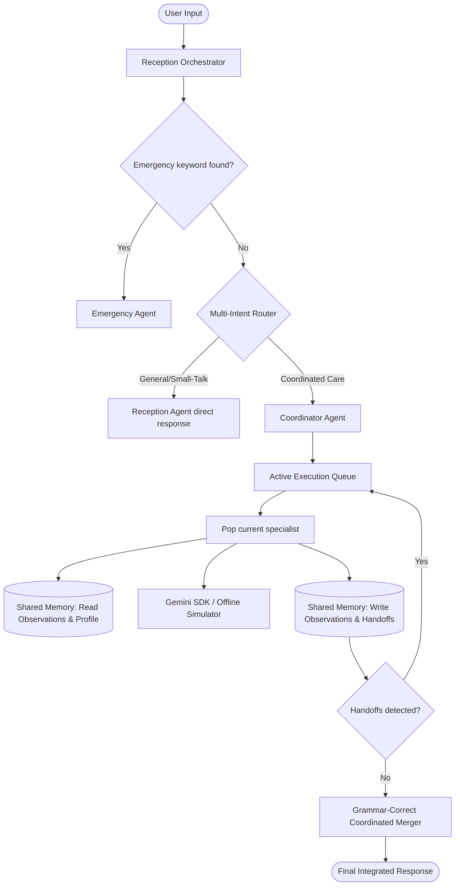

# 🏥 HealthMate AI 2.0

HealthMate AI 2.0 is a production-quality, terminal-based Personal Healthcare Assistant built on a collaborative **Agent-to-Agent (A2A) Cooperative Multi-Agent Architecture** utilizing central **Shared Memory** and Google Gemini.

---

## 1. System Architecture

HealthMate AI 2.0 coordinates multiple specialist agents sequentially, enabling them to communicate, share transient findings, and dynamically delegate tasks to one another.



---

## 2. Core A2A & Memory Integration Mechanics

### 2.1 Central Shared Memory (`memory/memory_manager.py`)
Memory is divided into two distinct scopes:
1. **Persistent Profile Fact Base**: Stores long-term user facts (name, age, weight, height, allergies, medical history, goals) to disk. It supports metric/imperial auto-conversion.
2. **Transient Turn Observations**: A scratchpad that is wiped clean at the beginning of each query turn. Specialists use this to register findings (e.g., `SymptomAgent` writes `fever` findings). Subsequent specialists in the same turn read these findings and customize their recommendations automatically.

### 2.2 Dynamic Agent-to-Agent (A2A) Handoffs
Specialist agents can dynamically register new target agents to the Coordinator's active execution queue during processing:
* **Fever/Gastric symptoms**: `SymptomAgent` registers handoffs to `diet` and `medicine` to cover hydration and safety warnings.
* **Musculoskeletal pain**: `SymptomAgent` registers handoffs to `fitness` for joint-friendly rehabilitation movement.
* **Skin/Scalp issues (dandruff/shedding)**: `SkinHairAgent` registers handoffs to `diet` to outline nutrient-rich metabolic foods.
* **Exercise loads**: `FitnessAgent` registers handoffs to `diet` to match physical training calorie deficits/surpluses.

### 2.3 Coordinated Merger
The `CoordinatorAgent` executes the queue, gathers responses, strips duplicate safety disclaimers, and merges outputs using custom singular/plural introductory greetings depending on which specialists were active.

---

## 3. Specialist Agent Directory

| Agent ID | Class Name | Specialist Persona | Primary Responsibility |
| :--- | :--- | :--- | :--- |
| `reception_agent` | `ReceptionAgent` | Warm front-desk orchestrator | Greet users, classify intents, filter emergency life-threats. |
| `emergency_agent` | `EmergencyAgent` | Safety-first first-responder | Direct, zero-delay bypass for choking, chest pain, and stroke. |
| `coordinator_agent`| `CoordinatorAgent` | Collaborative supervisor | Execution queue controller and response merger. |
| `symptom_agent` | `SymptomAgent` | Clinical triage specialist | Educational triage, home-care precautions, clinical warning signs. |
| `diet_agent` | `DietAgent` | Metabolic nutritionist | Nutritional targets, meal splits, weight-adjusted hydration guidelines. |
| `fitness_agent` | `FitnessAgent` | Physical trainer | Exercise plans, joint-friendly splits, respiratory safety wraps. |
| `medicine_agent` | `MedicineAgent` | Pharmacist information | Side effects, therapeutic purpose, drug-drug warnings (no dosage). |
| `memory_agent` | `MemoryAgent` | Fact registrar | Metric conversions, data updates, and session forgetting. |

---

## 4. How to Run & Test

### 4.1 Installation
Install the system dependencies from `requirements.txt`:
```bash
pip install -r requirements.txt
```

### 4.2 Interactive Sandbox Testing
Run the interactive terminal sandbox (runs with offline high-fidelity simulator defaults when no real Gemini API key is configured):
```bash
# PowerShell
$env:PYTHONIOENCODING="utf-8"
python test_playground.py

# CMD
set PYTHONIOENCODING=utf-8
python test_playground.py
```

### 4.3 Automated Verification Tests
Execute the comprehensive automated scenario tests (verifying cooperative workflows, handoffs, and state carryover):
```bash
python -m pytest -v
```
